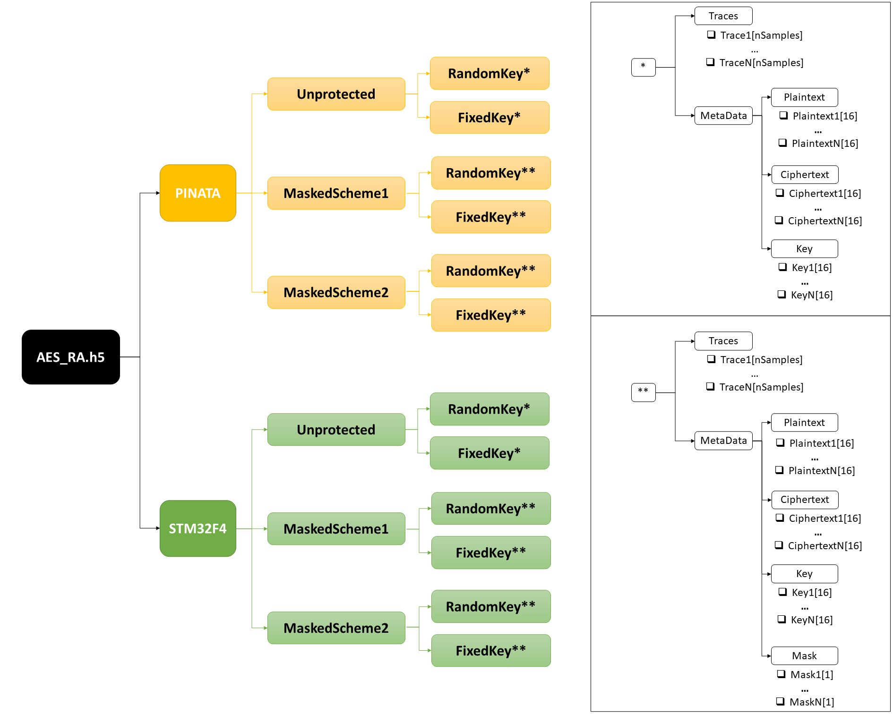

# The *AES_RA* Dataset
Power/EM traces from two different boards operating several AES implementations.
[Download link](https://drive.google.com/)

## Dataset Organization
The AES_RA dataset is stored in a single file in HDF5 format. This file has two groups (PINATA and STM32F4), one for each of the two devices. 
Each group has three subgroups, corresponding with each one of the three considered AES implementations. 
In turn, each implementation is divided into the Random Key set (Profiling) and the Fixed key set (Attack). 
Finaly, we have the subgroups corresponding with the traces and the metadata. An organisational chart is shown in the following figure:

