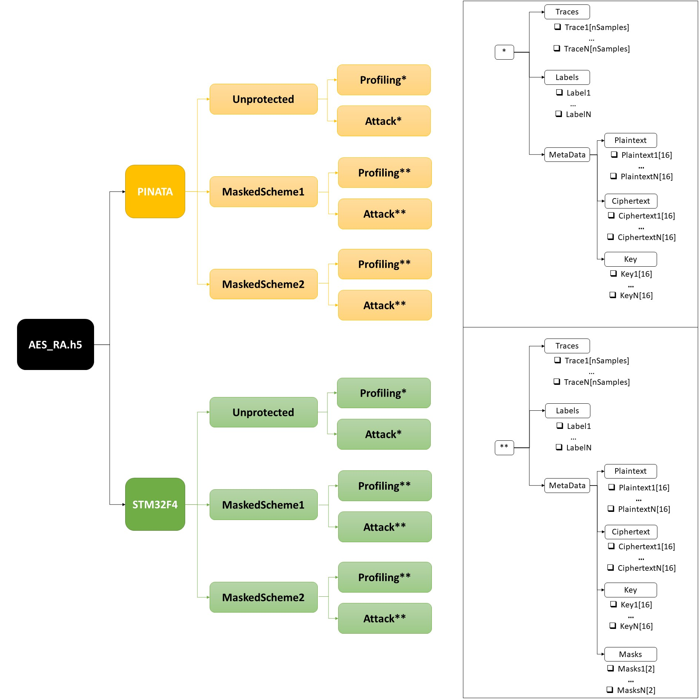

# The *AES_RA* Dataset
This dataset contains Power/EM traces from two different boards operating several AES implementations. More specifically, two different embedded systems which use microcontrollers from the same family: power consumption traces from the Piñata board and capacitor EM power traces from the STM32F411E-Discovery Board. With each device, we capture traces from three AES implementations: an unprotected software AES and two different masking schemes, resulting in six different setups. 
[Download link](https://drive.google.com/)

## Device(s) under test
### Piñata board
Piñata is a development board created by Riscure based on an ARM Cortex-M4F core working at a 168MHz clock speed. It has been physically modified and programmed to be a training target for SCA and Fault Injection. We measure the power consumption of the board during the AES encryption with a Tektronix CT1 current probe attached to a 20 GS/s digital oscilloscope (LeCroy Waverunner 9104) triggered by the microcontroller, which rises a GPIO signal when the internal computation starts. Each power trace consists of 1260 samples (1500 and 1800 for the masked implementations 1 and 2 respectively) taken at 1 GHz with 8-bit resolution, corresponding to the first SBox operation. 

### STM32F411E-DISCO Board
The STM32F411E-DISCO is a development board with an STM32F411VE high-performance Arm Cortex -M4 32-bit RISC microcontroller working at 100 MHz. This board (STM32F411E-DISCO) is similar to Piñata (microcontrollers are from the same family), and uses exactly the same code. We measure the power consumption of the board during the AES encryptions with a Langer EM probe over a decoupling capacitor (C38) attached to the oscilloscope (LeCroy Waverunner 9104), wich again is GPIO-triggered by the microcontroller. Each power trace consists of 1225 samples (1500 and 1800 for the masked implementations 1 and 2 respectively). 

## AES Implementations
- **Unprotected AES:** Typical AES-128 (in ECB mode) software implementation taken [from](https://github.com/kokke/tiny-AES-c)
- **Masked Scheme 1:** A modification of the previous one which matches the same masking method described in [[1]](#1) (Masked Lookup Table). In this implementation, the the output mask of the SBox operation is removed after each 1-Byte lookup and hence we see a clear correlation of the mask in the SBox time window. Below is the pseudocode of this implementation:

- **Masked Scheme 2:** A modification of the previous one, but this time the output mask is removed after the MixColumns operation. This means that, unlike in the previous scheme, the output mask does not leak during the SBox computation. Below is the pseudocode of this implementation:

## Dataset Organization
The AES_RA dataset is stored in a single file in HDF5 format. This file has two groups (PINATA and STM32F4), one for each of the two devices. 
Each group has three subgroups, corresponding with each one of the three considered AES implementations. 
In turn, each implementation is divided into the Random Key set (Profiling) and the Fixed key set (Attack). 
Finaly, we have the subgroups corresponding with the traces and the metadata. An organisational chart is shown in the following figure:

## References
<a id="1">[1]</a> 
S. Mangard, E. Oswald, T. Popp,
Power Analysis Attacks: Revealing the Secrets of Smart Cards.,
Springer, 2007.
